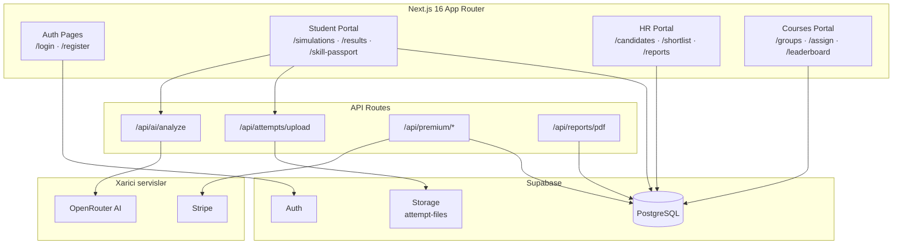
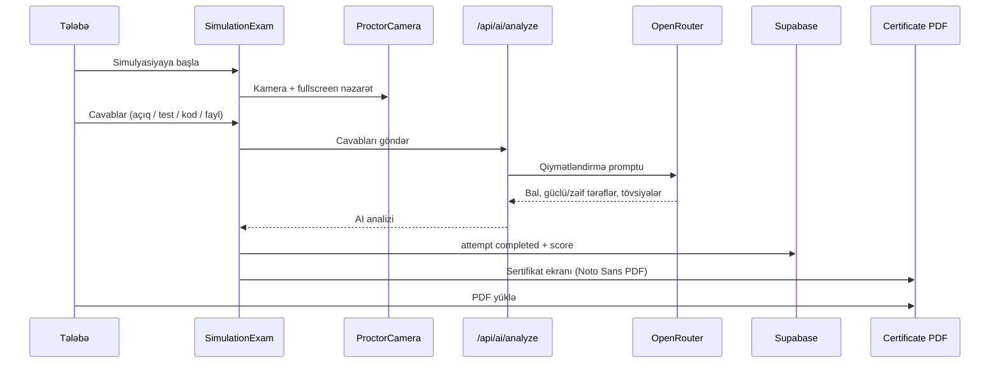
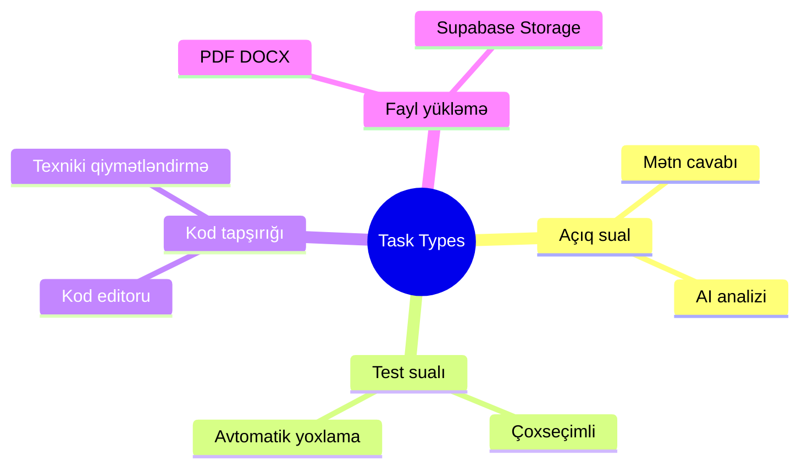

<p align="center">
  
</p>

<p align="center">
  <a href="https://jobsim-ai.vercel.app"></a>
  
  
  
  
</p>

# JobSim AI

**JobSim AI** — tələbələr, HR komandaları və universitet/kurs müəllimləri üçün AI ilə idarə olunan **iş simulyasiyası** və **bacarıq əsaslı işə qəbul** platforması.

Namizədlər real şirkət ssenariləri üzrə simulyasiya keçir, AI cavabları qiymətləndirir, nəticə və **PDF sertifikat** alır. HR tərəfi namizədləri müqayisə edir, qısa siyahı yaradır və hesabat export edir.

---

## Mündəricat

- [Canlı demo](#canlı-demo)
- [Platforma vizualı](#platforma-vizualı)
- [Əsas xüsusiyyətlər](#əsas-xüsusiyyətlər)
- [Rollar və istifadəçi axınları](#rollar-və-istifadəçi-axınları)
- [Simulyasiya tamamlama axını](#simulyasiya-tamamlama-axını)
- [Texnologiya steki](#texnologiya-steki)
- [Layihə strukturu](#layihə-strukturu)
- [Quraşdırma](#quraşdırma)
- [Database & SQL faylları](#database--sql-faylları)
- [Seed skriptləri](#seed-skriptləri)
- [Premium & ödəniş](#premium--ödəniş)
- [Deploy (Vercel)](#deploy-vercel)
- [Demo hesablar](#demo-hesablar)
- [Roadmap](#roadmap)
- [Lisenziya](#lisenziya)

---

## Canlı demo

| Link | Təsvir |
|------|--------|
| [jobsim-ai.vercel.app](https://jobsim-ai.vercel.app) | Production mühit |
| `/login` | Giriş səhifəsi |
| `/register` | Qeydiyyat (Student / HR / Courses) |
| `/student/simulations` | Simulyasiya kitabxanası |
| `/student/results` | Nəticələr + sertifikat |
| `/hr/dashboard` | HR paneli |
| `/courses/dashboard` | Kurs/müəllim paneli |

---

## Platforma vizualı

### Rol əsaslı arxitektura



### Simulyasiya tamamlama axını



### Sualların növləri



---

## Əsas xüsusiyyətlər

| Modul | Xüsusiyyətlər |
|-------|----------------|
| **Tələbə** | Simulyasiya kitabxanası, freemium (2 pulsuz sim), proktorlu imtahan, AI analiz, nəticə tarixçəsi, **PDF sertifikat**, Skill Passport |
| **HR** | Simulyasiya yaratma (4 addım), namizəd cədvəli, qısa siyahı, müqayisə, radar chart, PDF hesabat |
| **Kurslar** | Qrup yaratma, join code, tapşırıq vermə, liderbord, tələbə irəliləyişi |
| **AI** | OpenRouter ilə real-time cavab analizi, bal (0–100), bacarıq skorları |
| **Premium** | Stripe checkout + promo kod aktivləşdirmə |
| **Təhlükəsizlik** | Supabase RLS, kamera proktorluğu, 3 xəbərdarlıq = ləğv |

---

## Rollar və istifadəçi axınları

### Tələbə (`student`)
1. Qeydiyyat / giriş
2. Simulyasiya seç → imtahan (kamera aktiv)
3. Sualları cavablandır → AI analiz
4. Sertifikat + nəticələr səhifəsi
5. Skill Passport avtomatik yenilənir

### HR (`hr`)
1. Şirkət simulyasiyası yarat (açıq sual, test, kod, fayl)
2. Namizəd cəhdini izlə
3. Qısa siyahıya əlavə et / müqayisə et
4. Hesabat export (PDF)

### Kurs müəllimi (`courses`)
1. Qrup yarat, join code paylaş
2. Simulyasiya təyin et
3. Tələbə irəliləyişini və liderbordu izlə

---

## Texnologiya steki

| Kateqoriya | Texnologiya |
|------------|-------------|
| Framework | Next.js 16 (App Router), React 19, TypeScript |
| Styling | Tailwind CSS **3.4**, custom design system (cream / forest / coral) |
| Database & Auth | Supabase (PostgreSQL + Auth + Storage) |
| AI | OpenRouter (`nvidia/nemotron-3.5-lightning` only) |
| Charts | Recharts |
| PDF | jsPDF + Noto Sans (Azərbaycan Unicode dəstəyi) |
| Payments | Stripe (optional) + promo kodlar |
| Deploy | Vercel |
| State | Zustand, React hooks |

---

## Layihə strukturu

```
jobsim-ai/
├── docs/
│   └── banner.svg              # README banner
├── public/
│   └── fonts/                  # Noto Sans (sertifikat PDF)
├── scripts/
│   ├── seed-real-content.mjs   # Şirkət simulyasiyaları + ADA qrupu
│   ├── seed-it-simulations.mjs # IT simulyasiyaları
│   └── seed-expand-tasks.mjs   # Genişləndirilmiş tapşırıqlar
├── SQL_SCHEMA.sql              # Əsas schema
├── SQL_PREMIUM.sql             # Premium cədvəlləri
├── SQL_STORAGE.sql             # Fayl yükləmə bucket/policy
├── SQL_FIX_*.sql               # RLS / trigger düzəlişləri
└── src/
    ├── app/
    │   ├── (auth)/             # login, register
    │   ├── student/            # tələbə portalı
    │   ├── hr/                 # HR portalı
    │   ├── courses/            # kurs portalı
    │   └── api/                # AI, upload, premium, PDF
    ├── components/
    │   ├── simulation/         # Exam, Certificate, Results, Proctor
    │   ├── hr/                 # HR UI
    │   ├── courses/            # Qruplar, tapşırıqlar
    │   └── ui/                 # Shared UI
    ├── lib/
    │   ├── certificate.ts      # PDF sertifikat generatoru
    │   ├── openrouter.ts       # AI client
    │   ├── simulation-access.ts
    │   └── supabase/
    └── types/
```

---

## Quraşdırma

### Tələblər

- Node.js 20+
- npm
- Supabase hesabı
- OpenRouter API açarı

### 1. Repozitoriyanı klonlayın

```bash
git clone https://github.com/nemet2006/jobsim-ai.git
cd jobsim-ai
```

### 2. Asılılıqlar

```bash
npm install
```

### 3. Environment variables

`.env.local.example` faylını `.env.local` olaraq kopyalayın:

```bash
cp .env.local.example .env.local
```

```env
NEXT_PUBLIC_SUPABASE_URL=https://your-project.supabase.co
NEXT_PUBLIC_SUPABASE_ANON_KEY=your_anon_key
SUPABASE_SERVICE_ROLE_KEY=your_service_role_key

OPENROUTER_API_KEY=sk-or-v1-...
# Model is hardcoded: nvidia/nemotron-3.5-lightning (no fallbacks)

# Optional
STRIPE_SECRET_KEY=sk_test_...
STRIPE_PRICE_ID=price_...
STRIPE_WEBHOOK_SECRET=whsec_...
PREMIUM_PROMO_CODES=JOBSIM2026!
NEXT_PUBLIC_SITE_URL=http://localhost:3000
```

### 4. Database

Supabase SQL Editor-də sıra ilə işə salın:

1. `SQL_SCHEMA.sql`
2. `SQL_FIX_POLICIES.sql` (RLS insert düzəlişləri)
3. `SQL_PREMIUM.sql`
4. `SQL_STORAGE.sql`
5. `SQL_SECURITY.sql` — **production security (roles, scoring, rate limits)**
6. `SQL_ANALYTICS.sql` — **traction/analytics sistemi + admin rolu**

### 5. Development server

```bash
npm run dev
```

Brauzer: [http://localhost:3000](http://localhost:3000)

---

## Database & SQL faylları

| Fayl | Məqsəd |
|------|--------|
| `SQL_SCHEMA.sql` | Cədvəllər, enum-lar, RLS, trigger-lər |
| `SQL_PREMIUM.sql` | Premium abunəlik strukturu |
| `SQL_STORAGE.sql` | `attempt-files` bucket və policy-lər |
| `SQL_SECURITY.sql` | Role/scoring protection, secure join, rate limits |
| `SQL_FIX_POLICIES.sql` | INSERT policy düzəlişləri |
| `SQL_GROUPS_*.sql` | Qrup modulu migration/fix |
| `SQL_ANALYTICS.sql` | Traction/analytics eventləri, admin rolu, rollup/cleanup |

**Əsas cədvəllər:** `users`, `simulations`, `simulation_attempts`, `skill_passport`, `shortlist`, `course_groups`, `group_members`, `assignments`, `analytics_events`

---

## Traction / Analytics sistemi

Platforma öz first-party analytics sisteminə malikdir — bütün məlumat Supabase-də qalır, üçüncü tərəf tracker yoxdur.

**Nə izlənir:**

- Səhifə baxışları və unikal ziyarətçilər (anonim `session_id`, PII yoxdur) — `src/instrumentation-client.ts`
- Klik/funnel eventləri: nav, login/register, simulyasiya imtahanı, premium CTA — `src/lib/analytics-client.ts`
- Server-təsdiqli conversion-lar: `user_registered`, `simulation_started`, `simulation_completed`, `premium_activated`, `group_joined` — `src/lib/analytics.ts`

**Privacy qaydaları:** email, ad, cavablar və xam IP heç vaxt saxlanılmır. Yalnız whitelist edilmiş property açarları qəbul olunur (`src/lib/analytics-shared.ts`).

**Quraşdırma:**

1. Supabase SQL Editor-də `SQL_ANALYTICS.sql` işlədin.
2. Öz hesabınızı admin edin:

```sql
UPDATE public.users SET role = 'admin' WHERE email = 'siz@example.com';
```

3. `/admin/dashboard` — canlı traction paneli (30 saniyədə bir avtomatik yenilənir), `/admin/events` — raw event axını.

**Cron (tövsiyə):** Supabase-də `pg_cron` aktivləşdirib `SQL_ANALYTICS.sql` faylının sonundakı `cron.schedule` nümunələri ilə gündəlik rollup (`refresh_analytics_daily_metrics`) və retention cleanup (`cleanup_analytics_events`) qurun.

**Qeyd:** qeydiyyat/simulyasiya/premium metrikaları biznes cədvəllərindən hesablandığı üçün tracking-dən əvvəlki tarixçəni də əhatə edir; səhifə baxışı və klik metrikaları yalnız tracking aktivləşən tarixdən yığılır.

---

## Seed skriptləri

Real platforma məzmunu yükləmək üçün:

```bash
# 10 şirkət simulyasiyası + ADA kurs qrupu + demo tələbələr
npm run seed:real

# HR paneli: namizədlər, shortlist, hesabatlar (bütün HR hesablar)
npm run seed:hr

# Yalnız bir HR üçün:
node --env-file=.env.local scripts/seed-hr-panel.mjs --email=hr@kapitalbank.az

# 8 IT simulyasiyası
npm run seed:it

# Backend Dev, DevOps, Full Stack tapşırıqlarını genişləndir
npm run seed:tasks
```

**Seed-dən sonra:**
- Kurs hesabı: `karyera@ada.edu.az` / `JobSim2026!`
- Join code: seed çıxışında göstərilir (məs. `6E1209`)
- Demo şifrə (bütün seed hesablar): `JobSim2026!`

---

## Premium & ödəniş

| Üsul | Təsvir |
|------|--------|
| **Promo kod** | `PREMIUM_PROMO_CODES` env-də (məs. `JOBSIM2026!`) |
| **Stripe** | `/api/premium/checkout` → webhook → `is_premium=true` |
| **Freemium** | 2 ən yeni simulyasiya pulsuz, qalanları kilidlidir |

---

## Deploy (Vercel)

```bash
npx vercel login
npx vercel --prod
```

Vercel Environment Variables-a `.env.local` dəyərlərini əlavə edin.

**Production:** https://jobsim-ai.vercel.app

---

## Demo hesablar

| Rol | Email (nümunə) | Şifrə |
|-----|----------------|-------|
| Kurs müəllimi | `karyera@ada.edu.az` | `JobSim2026!` |
| Seed tələbələr | seed çıxışında | `JobSim2026!` |

**Dəvət kodları** (qeydiyyatda HR / Müəllim seçəndə):

| Rol | Dəvət kodu |
|-----|------------|
| HR / Şirkət | `JOBSIM-HR-2026` |
| Kurs / Müəllim | `JOBSIM-UNI-2026` |

> Öz Supabase layihənizdə qeydiyyatdan keçərək yeni hesab da yarada bilərsiniz.

---

## Sertifikat sistemi

Simulyasiya tamamlandıqdan sonra:

- Ekranda **CertificateCard** (bal, dərəcə, ID)
- **PDF yüklə** — Noto Sans şrifti ilə Azərbaycan hərfləri düzgün render olunur
- `/student/results` səhifəsində yenidən endirmək mümkündür

Sertifikat ID formatı: `JSIM-XXXXXXXXXXXX`

---

## Roadmap

- [ ] Sertifikat verify URL (`verify.jobsim-ai.app`)
- [ ] Real-time leaderboard WebSocket
- [ ] Çoxdilli interfeys (AZ / EN)
- [ ] Mobil tətbiq (React Native)

---

## Lisenziya

Bu layihə hazırda **private MVP** kimi inkişaf etdirilir. İstifadə və paylanma müəlliflə razılaşdırılır.

---

<p align="center">
  <strong>JobSim AI</strong> — praktiki bacarıqları ölç, real işə hazırla.
  <br />
  <a href="https://jobsim-ai.vercel.app">jobsim-ai.vercel.app</a>
</p>
